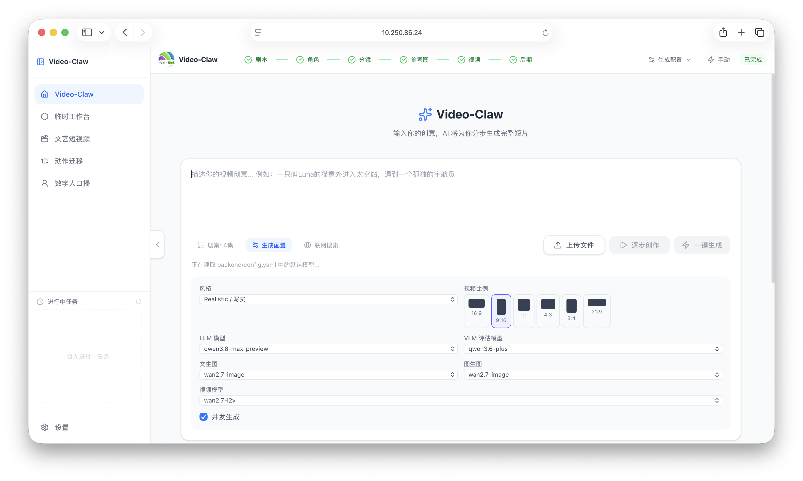
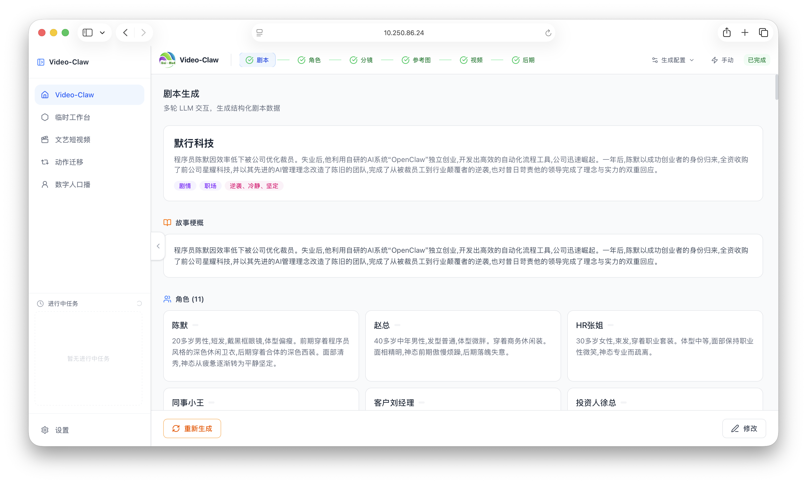
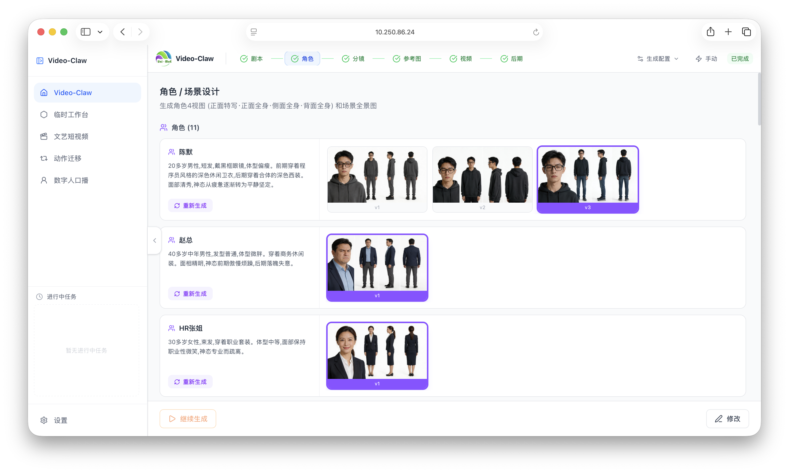
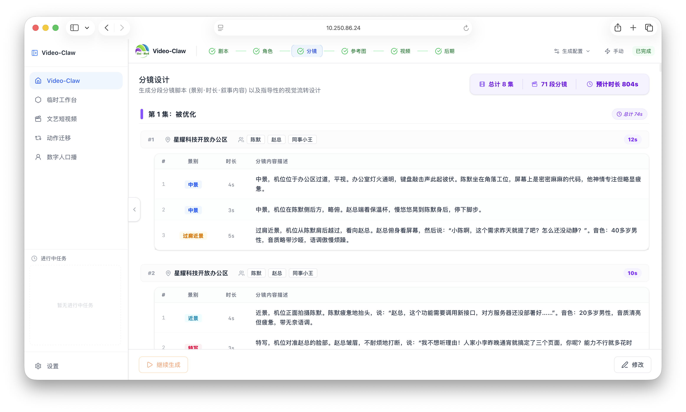
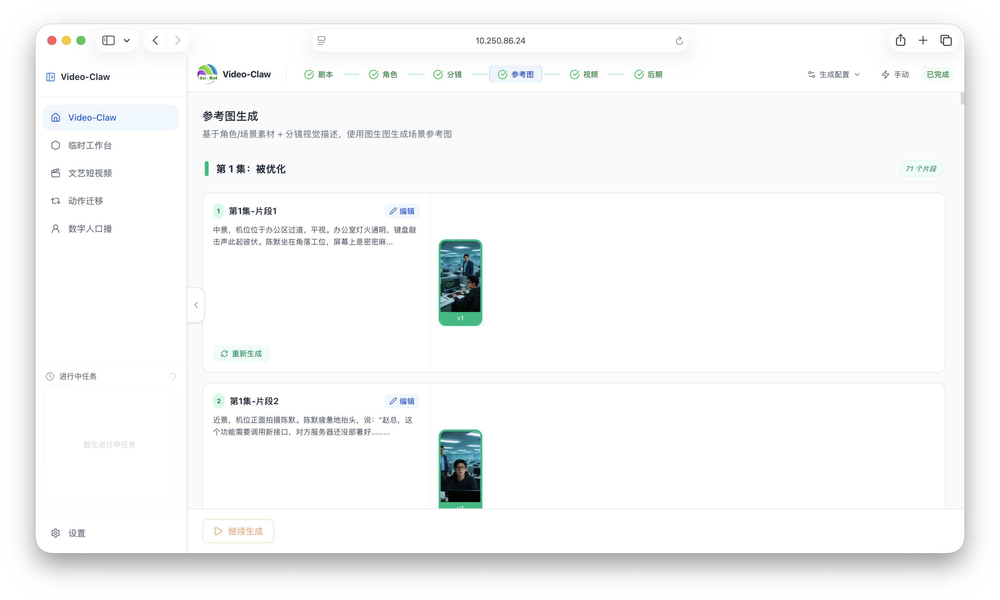
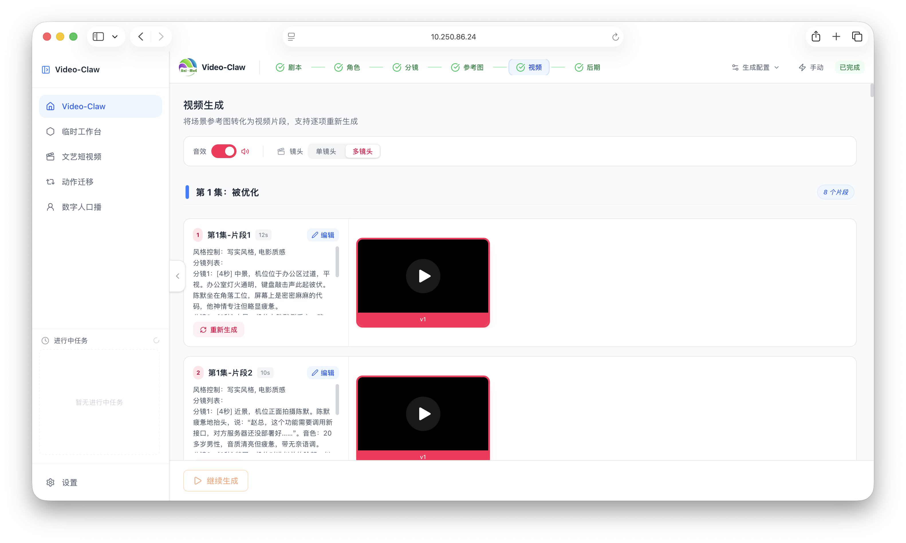
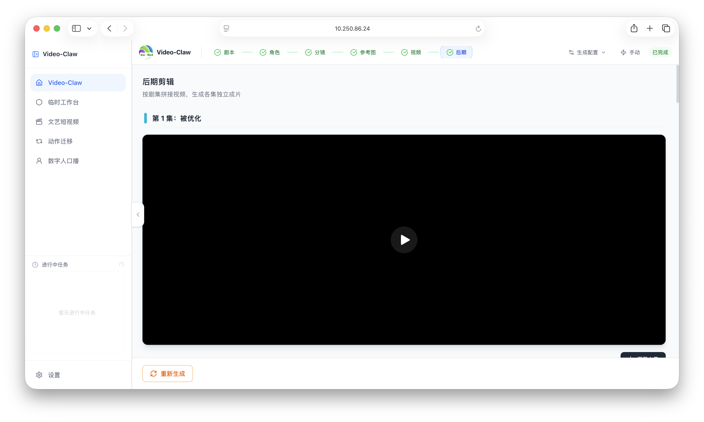

<p align="center">
  
</p>

<h1 align="center">
  Video-Claw: AI 创意视频生成员工
</h1>

<p align="center">
  <b>简体中文</b> | <a href="./README_EN.md">English</a>
</p>

<h3 align="center">
  
  <a href="https://github.com/HITsz-TMG/VideoClaw/blob/main/LICENSE">
    
  </a>
  <a href="https://github.com/HITsz-TMG/VideoClaw/stargazers">
    
  </a>
  <a href="https://github.com/HITsz-TMG/VideoClaw/fork">
    
  </a>
  
  <a href="#openclaw-integration">
    
  </a>
</h3>

<p align="center">
  <b><i><font size="5">直接与 <a href="https://github.com/openclaw/openclaw">OpenClaw</a> 对话："生成 X 的视频" → 搞定。</font></i></b>
</p>

<div align="center">

📺 [**Bilibili**](https://space.bilibili.com/2031891503?spm_id_from=333.1007.0.0)  ▶️ [**YouTube**](https://www.youtube.com/@imryanxu)  📖 [**集成指南**](#方式三openclaw-自动配置)   🦀 [**ClawHub**](https://clawhub.ai/hit-cxf/video-claw)

<a href="https://trendshift.io/repositories/24295" target="_blank"></a>

</div>

# 💥 News

- `2026/3/27`: 🎬 AIGC-Claw 正式发布，支持从想法到视频生成全流程自动化，用户可随时介入调整。
- `2026/4/6`: 🎭 AIGC-Claw 推出第二版，针对短剧进行优化。
- `2026/4/9`: ♾️ AIGC-Claw 推出第三版，新增无限续写，剧情可自定义。
- `2026/4/29`: 🧩 新增文艺短视频、动作迁移、数字人口播三个 Pipeline，并支持一键安装。
- `2026/5/8`: ⚙️ 支持通过 WebUI 配置 API 与默认模型，支持一键安装。
- `2026/5/13`: 🎞️ 文艺短视频接入 Pixelle-Video 的 HTML 模版。
- `2026/5/14`: 🎉 AIGC-Claw 正式更名为 Video-Claw

# 📖 项目介绍

<p align="center">
  
</p>

Video-Claw 是一个面向创意视频生产的 AI 导演系统。**你只需要给出一句想法、一个故事梗概，甚至一个模糊概念，系统就会把它拆解为可执行的影视工作流，持续产出可查看、可确认、可修改、可交付的中间资产，最终生成完整成片**。

它不是单点式的文生视频工具，而是一条覆盖 **剧本策划 → 角色/场景设计 → 分镜规划 → 参考图生成 → 视频生成 → 后期剪辑** 的全流程生产线。相比只给你一个黑盒结果的闭源视频生成框架，Video-Claw是一个真正可协作的 AI 导演团队：前一阶段决定后一阶段，所有关键节点都能可视化、可编辑、可继续生成。

除主流程外，Video-Claw 也提供三个一次性 Pipeline，用于更轻量、更直接的视频生成任务：文艺短视频、动作迁移和数字人口播。Pipeline 任务会实时推送进度与产物，生成结果和历史记录会在本地保留，便于继续查看、删除和复用。

# 📺 创作展示

## 🎬 VideoClaw

<details>
<summary><b>点击查看WebUI界面设计</b></summary>

| 阶段          | 示意图                                                               | 说明                                                                                                                                                     |
| ------------- | -------------------------------------------------------------------- | -------------------------------------------------------------------------------------------------------------------------------------------------------- |
| 首页          |  | 展示系统概览，支持查看历史项目、创建新项目以及全局配置（API Key 和默认模型设置），是创作流程的起点。                                                     |
| 剧本策划      |   | 输入创意标题与项目梗概，系统自动生成结构化的多场次剧本（包含旁白与对话），并支持对后续剧情的智能续写。                                                   |
| 角色/场景设计 |   | 基于剧本自动提取角色与场景的核心特征，生成风格统一的参考原画，作为后续分镜生成的视觉基础。                                                               |
| 分镜规划      |   | 将每一场剧本拆解为连续的视觉分镜，详细制定镜头视角、动作描述及参考内容，确保影视级的叙事连贯性。                                                         |
| 参考图生成    |   | 为每个分镜场次生成高质量、高精度的参考底图，精确控制光影细节与画面构图，作为视频生成的关键视觉基准。                                                     |
| 视频生成      |   | 调用主流高性能视频生成模型（如 Wan、Kling 等）将分镜图转化为动态片段，支持基于外部视频的动作迁移能力。                                                   |
| 后期剪辑      |   | 自动聚合所有生成的视频片段，同步渲染 TTS 配音、添加背景音乐及字幕，最终一键导出可供发布的成片视频。                                                      |

</details>

### 🔊 微短剧：deepseek-v4 震撼发布

使用 deepseek-v4 + gpt-image-2 + happy-horse-1.0 生成

<div align="center">
<table align="center" border="0" cellspacing="0" cellpadding="0" style="border:none; border-collapse:collapse; margin:0 auto;">
  <tr>
    <td align="center" valign="bottom" width="25%" style="border:none;"></td>
    <td align="center" valign="bottom" width="25%" style="border:none;">
      <video src="https://github.com/user-attachments/assets/627e961e-bd0e-449c-987e-9bae34b669c7" controls width="100%" preload="none"></video>
      <br><b>▶️ 破壁之锤</b>
    </td>
    <td align="center" valign="bottom" width="25%" style="border:none;">
      <a href="https://github.com/user-attachments/assets/ebb47cb8-fa9f-4557-b70c-ff6368ee0b6c" target="_blank">
        
      </a>
      <br><b>▶️ 破壁之锤 原画质</b>
    </td>
    <td align="center" valign="bottom" width="25%" style="border:none;"></td>
  </tr>
</table>
</div>

<br>

### 📱 系列一：程序员被裁后利用 openclaw 收购原公司 (写实 短剧)

> 共 8 集，跌宕起伏的逆袭之路（首次生成 6 集 + 续写 2 集）

<table>
  <tr>
    <td align="center" valign="top" width="25%">
      <a href="https://github.com/user-attachments/assets/1d095b82-3a72-4acc-9ca1-3ff4a6189232">
        
      </a>
      <br><b>▶️ 第 1 集</b><br>被优化
    </td>
    <td align="center" valign="top" width="25%">
      <a href="https://github.com/user-attachments/assets/489c5343-6345-4bce-81dc-bf6012b9c1cf">
        
      </a>
      <br><b>▶️ 第 2 集</b><br>深夜启程 首单突破
    </td>
    <td align="center" valign="top" width="25%">
      <a href="https://github.com/user-attachments/assets/359809cf-678b-429c-bafa-55ff50fd3277">
        
      </a>
      <br><b>▶️ 第 3 集</b><br>AI获投 旧主危机
    </td>
    <td align="center" valign="top" width="25%">
      <a href="https://github.com/user-attachments/assets/5561a04a-5ab3-4099-bc63-2fdbcc48f8e9">
        
      </a>
      <br><b>▶️ 第 4 集</b><br>收购星耀
    </td>
  </tr>
  <tr>
    <td align="center" valign="top">
      <a href="https://github.com/user-attachments/assets/ae4c3618-1990-4ff5-ad85-e09f23b08f7d">
        
      </a>
      <br><b>▶️ 第 5 集</b><br>收购清算 新生
    </td>
    <td align="center" valign="top">
      <a href="https://github.com/user-attachments/assets/4ddbb725-34d8-478b-97bc-5d7143f73101">
        
      </a>
      <br><b>▶️ 第 6 集</b><br>新生 回望
    </td>
    <td align="center" valign="top">
      <a href="https://github.com/user-attachments/assets/1c1e5970-aaea-44ba-b041-5d551905bfde">
        
      </a>
      <br><b>▶️ 第 7 集</b><br>技术反噬
    </td>
    <td align="center" valign="top">
      <a href="https://github.com/user-attachments/assets/e56e6784-6e49-4891-b0bc-a32308dd2145">
        
      </a>
      <br><b>▶️ 第 8 集</b><br>坚守伦理 共渡难关
    </td>
  </tr>
</table>

<br>

### 🖥️ 系列二：乡村教师 (科幻 漫剧)

> 共 5 集，致敬伟大的文明传承

<table>
  <tr>
    <td align="center" valign="top" width="50%">
      <a href="https://github.com/user-attachments/assets/1ffe7b06-73e9-44cd-ad3f-afced5239f97">
        
      </a>
      <br><b>▶️ 第 1 集</b><br>最后一课
    </td>
    <td align="center" valign="top" width="50%">
      <a href="https://github.com/user-attachments/assets/7547e5d3-872c-4344-8727-ee2be109797d">
        
      </a>
      <br><b>▶️ 第 2 集</b><br>清扫计划
    </td>
  </tr>
  <tr>
    <td align="center" valign="top">
      <a href="https://github.com/user-attachments/assets/affed408-4df7-4ce7-9681-8f4ed45a6fcf">
        
      </a>
      <br><b>▶️ 第 3 集</b><br>临终托付
    </td>
    <td align="center" valign="top">
      <a href="https://github.com/user-attachments/assets/dc7a85a8-6912-4443-a995-3d8f3ca30bc8">
        
      </a>
      <br><b>▶️ 第 4 集</b><br>生死问答
    </td>
  </tr>
  <tr>
    <td align="center" valign="top">
      <a href="https://github.com/user-attachments/assets/1fb889c5-0e2b-40fa-a438-7399322ada47">
        
      </a>
      <br><b>▶️ 第 5 集</b><br>文明之光
    </td>
    <td align="center" valign="top">
      <!-- 留空，保持表格边框完整对齐 -->
    </td>
  </tr>
</table>

<br>

### 🎞️ 更多演示

<details>
<summary>独立微短剧片段</summary>

<table>
  <tr>
    <td align="center" valign="top" width="33%">
      <video src="https://github.com/user-attachments/assets/63c2f33c-da50-44f0-8c26-a65611479d6a" controls width="100%" preload="none"></video>
      <br><b>伦敦疑云</b>
    </td>
    <td align="center" valign="top" width="33%">
      <video src="https://github.com/user-attachments/assets/d7c65cad-05b9-46c8-ab0e-96e39909f978" controls width="100%" preload="none"></video>
      <br><b>一条狗的使命</b>
    </td>
    <td align="center" valign="top" width="33%">
      <video src="https://github.com/user-attachments/assets/ec67546e-2d3d-4b34-b1ad-7d860a9bc1aa" controls width="100%" preload="none"></video>
      <br><b>无人机系荔枝来</b>
    </td>
  </tr>
</table>

</details>

<br>

<details>
<summary><b>微信交互</b></summary>
<div align="center">

|                                                      |                                                      |                                                      |                                                      |
| :---------------------------------------------------: | :---------------------------------------------------: | :---------------------------------------------------: | :---------------------------------------------------: |
|  |  |  |  |

</div>
</details>


<br>

<details>
<summary><b>飞书交互</b></summary>
<div align="center">

|                                                      |                                                      |                                                      |                                                      |
| :---------------------------------------------------: | :---------------------------------------------------: | :---------------------------------------------------: | :---------------------------------------------------: |
|  |  |  |  |

</div>
</details>


## 🧩 快速创作

<details>
<summary><b>点击查看WebUI界面设计</b></summary>

| Pipeline   | 示意图                                                                            | 前端入口             | 说明                                                                                                                                                                                                   |
| ---------- | --------------------------------------------------------------------------------- | -------------------- | ------------------------------------------------------------------------------------------------------------------------------------------------------------------------------------------------------ |
| 文艺短视频 |         | 侧边栏「文艺短视频」 | 支持「图片拼接 / 动态视频」和「创作灵感 / 完整文案」两组模式。系统按句号切分旁白，为每个片段生成配图与语音；图片拼接模式合成图文短视频，动态视频模式继续调用图生视频模型生成片段；可选添加标题和字幕。 |
| 动作迁移   |  | 侧边栏「动作迁移」   | 输入参考图片、动作视频和提示词，调用支持动作迁移能力的视频模型生成结果视频。                                                                                                                           |
| 数字人口播 |    | 侧边栏「数字人口播」 | 输入人物图和口播文案，生成分句语音与数字人视频片段；多片段生成时会使用上一段尾帧衔接下一段，并用生成语音替换最终视频音轨。                                                                             |

</details>

### 文艺短视频

<div align="center">
<table align="center" border="0" cellspacing="0" cellpadding="0" style="border:none; border-collapse:collapse; margin:0 auto;">
  <tr>
    <td align="center" valign="top" width="25%" style="border:none;"></td>
    <td align="center" valign="top" width="25%" style="border:none;">
      <video src="https://github.com/user-attachments/assets/7a674bb7-6ee9-4b83-bfd3-0d880127b632" controls width="100%" preload="none"></video>
      <br><b>▶️ 山河入梦</b>
    </td>
    <td align="center" valign="top" width="25%" style="border:none;">
      <video src="https://github.com/user-attachments/assets/a62c8184-322d-4c06-b16f-19660766e816" controls width="100%" preload="none"></video>
      <br><b>▶️ 人生海海</b>
    </td>
    <td align="center" valign="top" width="25%" style="border:none;"></td>
  </tr>
</table>
</div>

<br>

### 动作迁移

<div align="center">
<table align="center" border="0" cellspacing="0" cellpadding="0" style="border:none; border-collapse:collapse; margin:0 auto;">
  <tr>
    <td align="center" valign="bottom" width="25%" style="border:none;">
      
      <br><b>🖼️ 输入图片 (柠檬鼠)</b>
    </td>
    <td align="center" valign="bottom" width="25%" style="border:none;">
      <video src="https://github.com/user-attachments/assets/21ce51bd-fbce-4772-9b8b-08532187f993" controls width="100%" preload="none"></video>
      <br><b>🎬 输入参考视频</b>
    </td>
    <td align="center" valign="bottom" width="25%" style="border:none;">
      <video src="https://github.com/user-attachments/assets/5eda5bdf-1180-4803-a6ea-34a7366148fb" controls width="100%" preload="none"></video>
      <br><b>🚀 生成结果</b>
    </td>
    <td align="center" valign="bottom" width="25%" style="border:none;"></td>
  </tr>
</table>
</div>

<br>

### 数字人口播

<br>

# ✨ 功能特性

| 能力                                     | 说明                                                                                                            |
| ---------------------------------------- | --------------------------------------------------------------------------------------------------------------- |
| 🎬**从创意到成片的全流程生成**     | 一条链路打通剧本、角色、分镜、参考图、视频片段与后期剪辑，把零散生成能力升级为完整视频生产工作流。              |
| 🖼️**分镜驱动的可控创作**         | 通过结构化剧本、分镜规划与参考图生成，让角色一致性、镜头表达和画面风格更稳定、更可控。                          |
| ✍️**可修改、可续写、可继续生成** | 支持剧情 / 分镜智能续写，也支持角色、参考图、视频阶段修改后重新生成，避免每次都从头开始。                       |
| 🧩**轻量 Pipeline 任务**           | 支持文艺短视频、动作迁移、数字人口播三类一次性任务，适合快速生成图文/动态短视频、动作迁移视频和口播视频。       |
| 🏷️**模型能力标签筛选**           | 后端统一在 `models/config_model.py` 登记模型信息，并按文本、图像、视频、TTS、动作迁移等能力标签筛选可用模型。 |
| 📡**实时任务状态和产物管理**       | Pipeline 前端通过事件订阅获取进度和产物，历史记录按功能分区展示，并支持同步删除任务元数据和产物文件夹。         |
| 📲**本地部署、多端协作、产物留存** | 支持 Web 界面、微信 / 飞书协作、OpenClaw Skill 集成，并对剧本、图片、视频片段和最终成片进行全链路留存。         |

---

# 🚀 快速开始

## 方式一：一键安装（推荐）

**Linux / MacOS 安装**：

```bash
# 1. 克隆项目
git clone https://github.com/HITsz-TMG/VideoClaw.git
cd VideoClaw

# 2. 进入应用目录并执行安装脚本
cd video-claw/video-claw
chmod +x install.sh
./install.sh

# 3. 返回项目根目录
cd ../..
```

**Windows 安装**：

```bat
# 1. 克隆项目
git clone https://github.com/HITsz-TMG/VideoClaw.git
cd VideoClaw

# 2. 进入应用目录并执行安装脚本
cd video-claw\video-claw
install.bat

# 3. 返回项目根目录
cd ../..
```

安装脚本会检查 Python、Node.js、npm 和 ffmpeg，安装后端与前端依赖，复制 `backend/config.yaml.example` 为 `backend/config.yaml`，并执行前端构建。安装完成后，先在 `backend/config.yaml` 中填入模型服务 API Key，并确认 `models` 中的主流程默认模型；也可以启动前端后通过侧边栏底部「设置」页面修改这些配置。配置完成后启动服务：

```bash
# 启动后端
cd video-claw/video-claw/backend
uv run python api_server.py

# 新终端启动前端
cd video-claw/video-claw/frontend
npm start
```

后端默认运行在 `http://localhost:8000`，前端默认运行在 `http://localhost:3000`。

如果只想安装依赖、暂时跳过前端构建，可以执行：

```bash
AIGC_DIRECTOR_SKIP_FRONTEND_BUILD=1 ./install.sh
```

## 方式二：手动安装

```bash
# 1. 克隆项目
git clone https://github.com/HITsz-TMG/Video-Claw.git
cd Video-Claw

# 2. 配置并启动后端
cd video-claw/video-claw/backend

# 安装后端依赖
uv sync

# 配置后端 YAML
cp config.yaml.example config.yaml
# 编辑 config.yaml 填入 API Key，并确认主流程默认模型
# 也可以启动前端后在「设置」页面修改

# 启动后端
uv run python api_server.py
# 服务运行在 http://localhost:8000
```

```bash
# 3. 配置并启动前端（新终端）
cd video-claw/video-claw/frontend
npm install
npm run build
npm start
# 访问 http://localhost:3000
```

如果没有安装 `uv`，也可以使用 `python -m venv venv` 与 `pip install -r requirements.txt` 安装后端依赖。

## 方式三：OpenClaw 自动配置

向 OpenClaw 发送消息：

```
帮我克隆git仓库：https://github.com/HITsz-TMG/Video-Claw.git
然后把Video-Claw中的video-claw文件夹递归复制到.openclaw/workspace/skills目录下，用作AIGC相关的skill
```

使用时建议指明 "使用 video-claw"：

```
用video-claw来生成一个视频，内容是"一条狗的使命"
```

## 方式四：通过 ClawHub 安装

请确保本地安装了clawhub-cli

打开终端，输入命令，所有询问均选择yes

```bash
clawhub install video-claw
```

安装完成后，ClawHub 会将 `video-claw` 复制到 `workspace/skills`（或指定的 skills 目录）。

之后可以参考方式一一键安装或方式二手动安装自行构建项目并运行，也可以使用OpenClaw完成后续项目构建。

在第一次使用 `video-claw` 时，如果没有手动构建项目，OpenClaw会自动构建前后端并运行，无需手动初始化（构建项目需要配置环境和编译，请耐心等待）。

---

# 🔧 配置说明

<details>
<summary><b>点击展开完整环境要求和变量</b></summary>

## 环境要求

- **Python**: 3.9+
- **Node.js**: 18+
- **npm**: 9+

## 后端配置

后端配置统一保存在 `video-claw/backend/config.yaml`，采用小写、层级化 YAML 结构。可直接编辑该文件，也可以在前端侧边栏底部进入「设置」页面修改。

- `api_providers` 保存各模型服务平台的密钥、接口地址和代理开关。
- `models` 保存**主流程**首页使用的默认模型。前端创建项目时会先读取这些默认值，再把具体模型参数传给后端；后端不会再为主流程自动兜底选择模型，缺少模型参数会直接报错。
- Pipeline（文艺短视频、动作迁移、数字人口播）不使用这里的主流程默认模型，需要在对应 Pipeline 页面单独选择模型。

## 前端设置页面

启动前后端后，可以在 Web 前端左侧边栏底部进入「设置」页面，无需手动编辑 YAML，也可以完成常用配置：

- 填写或更新 OpenAI、Gemini、DeepSeek、DashScope、火山方舟 ARK、Kling 等平台的 API Key / Access Key / Secret Key。
- 修改各 provider 的 `base_url`、`enable_proxy`，以及公共代理地址 `api_providers.common.proxy`。
- 选择主流程默认模型，包括 `llm`、`vlm`、`image_t2i`、`image_it2i`、`video`、`video_ratio` 和 `eval`。
- 保存后会写回 `backend/config.yaml`。API Key、代理和默认模型会被后续新建项目读取；`server.host`、`server.port` 等服务启动参数需要重启后端后完全生效。

```yaml
project_name: Video-Claw

server:
  host: 127.0.0.1
  port: 8000
  debug: false

api_providers:
  common:
    print_model_input: false
    proxy: ''
  openai:
    api_key: your_openai_key
    base_url: https://api.openai.com/v1
    enable_proxy: false
  gemini:
    api_key: your_gemini_key
    base_url: https://generativelanguage.googleapis.com/v1beta
    enable_proxy: false
  deepseek:
    api_key: your_deepseek_key
    base_url: https://api.deepseek.com/v1
    enable_proxy: false
  dashscope:
    api_key: your_dashscope_key
    base_url: https://dashscope.aliyuncs.com/api/v1
    enable_proxy: false
  ark:
    api_key: your_ark_key
    base_url: https://ark.cn-beijing.volces.com/api/v3
    enable_proxy: false
  kling:
    access_key: your_kling_access_key
    secret_key: your_kling_secret_key
    enable_proxy: false

models:
  llm: qwen3.5-plus
  vlm: qwen3.5-plus
  image_t2i: doubao-seedream-5-0-260128
  image_it2i: doubao-seedream-5-0-260128
  video: wan2.7-i2v
  video_ratio: '16:9'
  eval: qwen3.5-plus
```

`api_providers.common.proxy` 是唯一的代理地址。每个 provider 通过 `enable_proxy` 决定是否启用该代理，默认关闭，避免同一进程内不同模型调用互相污染。`server.host` / `server.port` 等服务启动参数保存后需要重启后端才会完全生效；API Key、代理配置和 `models` 中的主流程默认模型会被新的项目创建和模型调用读取。

## 密钥与模型对应关系

|          平台          | 配置字段                                                           | 常用用途                             |
| :--------------------: | :----------------------------------------------------------------- | :----------------------------------- |
|    **OpenAI**    | `api_providers.openai.api_key` / `base_url`                    | GPT 文本、视觉模型和 OpenAI 图像模型 |
|    **Gemini**    | `api_providers.gemini.api_key` / `base_url`                    | Gemini 文本、视觉模型                |
|   **DeepSeek**   | `api_providers.deepseek.api_key` / `base_url`                  | DeepSeek 文本模型                    |
|  **DashScope**  | `api_providers.dashscope.api_key` / `base_url`                 | 通义千问、通义万相、Wan 图像/视频等  |
| **火山方舟 ARK** | `api_providers.ark.api_key` / `base_url`                       | Seedream 图像、Seedance 视频等       |
|    **Kling**    | `api_providers.kling.access_key` / `secret_key` / `base_url` | 可灵视频生成                         |

只需要填写你实际选择模型所需的平台密钥。例如主流程默认图像模型是 `doubao-seedream-*` 时，需要配置 `ark.api_key`；默认视频模型是 `wan*` 时，需要配置 `dashscope.api_key`。如果在 Pipeline 页面选择了不同模型，也要确保对应平台的密钥已经填写。

## 可用模型

|        类型        | 模型                                                                                                                                                                        |
| :----------------: | :-------------------------------------------------------------------------------------------------------------------------------------------------------------------------- |
|   **LLM**   | qwen3.6-max-preview, qwen3-max, deepseek-chat, deepseek-reasoner, deepseek-v4-flash, deepseek-v4-pro, gpt-4o, gpt-5, gpt-5.4, gemini-2.5-flash, gemini-2.0-flash, kimi-k2.6 |
|   **VLM**   | qwen3.6-plus, qwen3.6-flash, kimi-k2.6, gpt-5.4, gemini-2.5-flash-image, gemini-2.0-flash                                                                                   |
|  **文生图**  | wan2.7-image, wan2.7-image-pro, wan2.6-t2i, doubao-seedream-5.0/4.5/4.0, gpt-image-2                                                                                        |
|  **图生图**  | wan2.7-image, wan2.7-image-pro, doubao-seedream-5.0/4.5/4.0, gpt-image-2                                                                                                    |
| **视频生成** | wan2.7-i2v, wan2.6-i2v-flash, doubao-seedance-2.0 (Normal/Fast), kling-v3/v2.6/v2.5                                                                                         |

模型信息以 `video-claw/video-claw/backend/models/config_model.py` 为准。前端和 Pipeline API 会根据模型能力标签筛选模型，例如文本生成、图像生成、图生视频、动作迁移、TTS 等。

</details>

# 产物说明

Video-Claw 的所有任务元数据与生成产物均保存在 `video-claw/video-claw/backend/code/` 目录下。

<details>
<summary><b>点击展开存储结构与标识说明</b></summary>

## 📁 存储结构

```text
video-claw/video-claw/backend/code/
├── data/
│   ├── tasks/                  # Pipeline 任务元数据 (JSON)
│   └── sessions/               # AIGC-Claw 会话元数据 (JSON)
└── result/
    ├── task/                   # Pipeline 生成产物 (按 Task ID 分类)
    │   └── <task_id>/          # e.g., 20260514_204946_961f95d9
    │       ├── audio_xx.mp3    # 分段音频
    │       ├── video_xx.mp4    # 分段视频
    │       ├── storyboard.json # 故事板数据
    │       └── final.mp4       # 最终合成视频
    ├── image/                  # AIGC-Claw 生成的图片
    │   └── <session_id>/       # 按会话 ID 分类
    │       ├── Assets/         # 角色与场景素材
    │       │   ├── characters/ # 角色参考图
    │       │   └── settings/   # 场景参考图
    │       └── Scenes/         # 生成的分镜参考图
    ├── video/                  # AIGC-Claw 生成的视频
    │   └── <session_id>/       # 按会话 ID 分类
    └── script/                 # AIGC-Claw 生成的剧本/分镜数据
```

## 🆔 标识说明

- **Task ID**: 格式为 `YYYYMMDD_HHMMSS_随机Hash` (例如 `20260514_204946_961f95d9`)，用于唯一标识一次 Pipeline 任务。
- **Session ID**: 毫秒级时间戳 (如 `1778810088325`)，用于关联主流程交互中的上下文数据与生成图片。

</details>

# 🙏 致谢

Video-Claw 的想法和设计受到了 [AutoResearchClaw](https://github.com/aiming-lab/AutoResearchClaw)、[huobao-drama](https://github.com/chatfire-AI/huobao-drama)、[LibTV](https://www.liblib.tv/) 与 [libtv-skills](https://github.com/libtv-labs/libtv-skills) 的启发。

[Pixelle-Video](https://github.com/AIDC-AI/Pixelle-Video)：Video-Claw 借鉴了文艺短视频、动作迁移、数字人口播三个 Pipeline，以及通过 HTML 模版精细控制图片、视频的文本。

# 📚 系列工作

|                                                                      框架图                                                                      | 论文信息                                                                                                                                                                                                                                                                                                                                                                     |
| :----------------------------------------------------------------------------------------------------------------------------------------------: | ---------------------------------------------------------------------------------------------------------------------------------------------------------------------------------------------------------------------------------------------------------------------------------------------------------------------------------------------------------------------------- |
|                                                            | **[SIGGRAPH Asia 2024] FilmAgent: Automating Virtual Film Production Through a Multi-Agent Collaborative Framework**`<br>`*Zhenran Xu, Jifang Wang, Longyue Wang, Zhouyi Li, Senbao Shi, Baotian Hu, Min Zhang*`<br>`[[Paper](https://doi.org/10.1145/3681758.3698014)] [[GitHub](https://github.com/HITsz-TMG/Video-Claw/blob/main/FilmAgent.md)]                     |
|    | **[SIGGRAPH Asia 2024] Anim-Director: A Large Multimodal Model Powered Agent for Controllable Animation Video Generation**`<br>`*Yunxin Li, Haoyuan Shi, Baotian Hu, Longyue Wang, Jiashun Zhu, Jinyi Xu, Zhen Zhao, Min Zhang*`<br>`[[Paper](https://doi.org/10.1145/3680528.3687688)] [[GitHub](https://github.com/HITsz-TMG/Anim-Director/tree/main/Anim-Director)] |
|  | **[SIGGRAPH Asia 2025] AniMaker: Multi-Agent Animated Storytelling with MCTS-Driven Clip Generation**`<br>`*Haoyuan Shi, Yunxin Li, Xinyu Chen, Longyue Wang, Baotian Hu, Min Zhang*`<br>`[[Paper](https://doi.org/10.1145/3757377.3764009)] [[GitHub](https://github.com/HITsz-TMG/Anim-Director/tree/main/AniMaker)]                                                 |

<p align="center">
  <sub>Built with 🦞 by the Lychee Agent team</sub>
</p>
